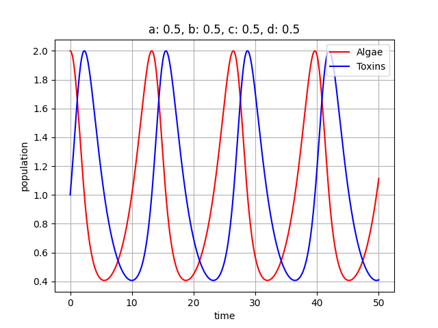
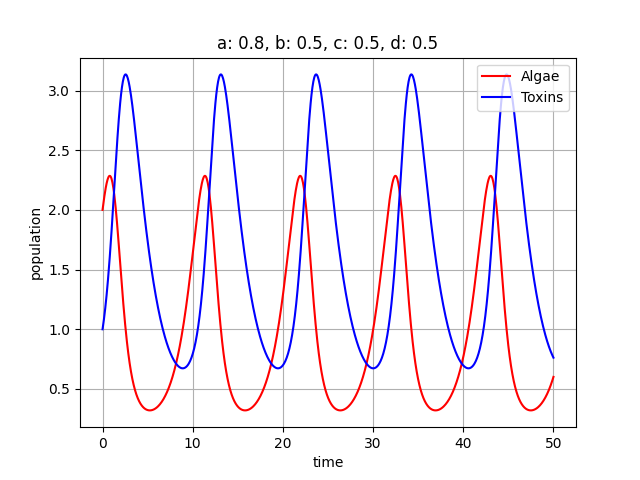
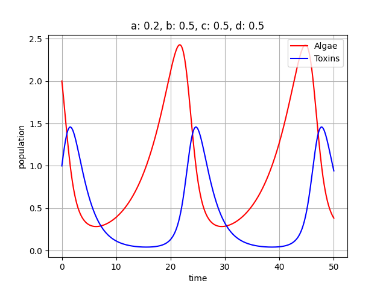
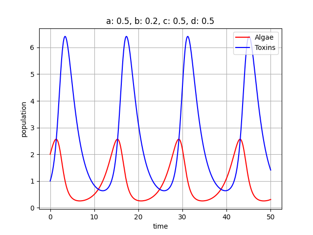
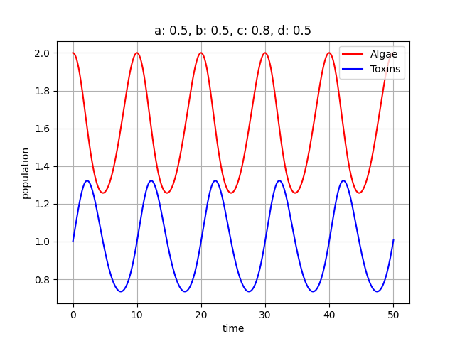
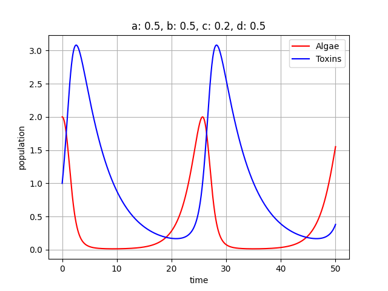
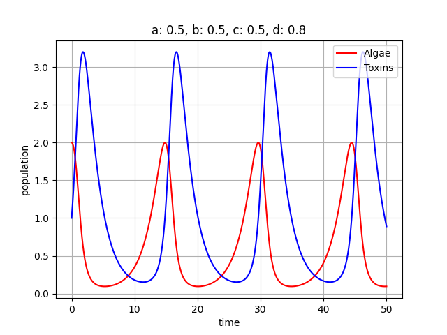
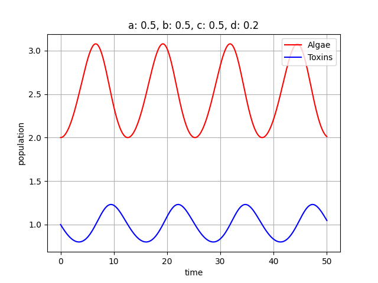

# OMM-seminarski

Lotka Voltera model:  
dX/dt = a*X - b*X*Y  
dY/dt = -c*Y + d*X*Y

a - natalitet vrste(alge, ljudi ili slicno)  
b - umanjenje vrste pod uticajem toksina  
c - mortalitet toksina  
d - stopa nastajanje toksina u zavisnosti od vrste  

***
Za početne parametre uzete su jednake vrednosti koje mi aproksimiraju neku zlatnu sredinu. Ovo je osnovni model na kom možemo videti kako se kroz vreme menjaju populacije algi i toksina. Početne vrednosti za alge i toksine su redom 2 i 1 (možemo ih posmatrati u hiljadama jedinki) i to samo znači da u početnom trenutku imamo dva puta više algi nego toksina. Na modelu možemo videti (time=10) kako se prilikom povećanja populacije postepeno povećava broj toksina do tačke optimuma (time=~12) kada zbog uticaja toksina počinje polako da opada populacija algi, a ubrzo nakon toga (time=~15) počinje i opadanje toksina jer se smanjuje broj algi od kojih oni zavise. Ovo je kružni proces koji traje kroz vreme.

***
Kada povećamo natalitet algi, možemo primetiti da alge za nijansu prelaze granicu 2 sa leve strane, ali je mnogo bitnije primetiti povećanje koncentrancije toksina, jer što je više algi to će se više toksina stvoriti. 

Kada smanjimo natalitet algi, možemo primetiti spor rast populacije algi što je očigledno na osnovu širokog levka koje pravi crvena linija. U skladu sa njom i plava linija sporo raste što znači da broj toksina prati populaciju algi.

***
Kada povećamo uticaj toksina na smrtnost algi, vidimo da crvena linija ima učestaliju frekvenciju što znači da nakon nastanka alge brzo izumiru. Zbog brzog izumiranja algi vidimo da se toksini ne mogu previše razviti.

Kada smanjino uticaj koje toksini imaju na smrtnost algi, to znači da će alge duže živeti. Sporu smrtnost algi možemo videti na osnovu širok levka koji pravi crvena linija. U skladu sa tim se povećava broj toksina kroz vreme jer alge duže žive i proizvode toksine.

***
Kada se poveća mortalitet toksina, vidimo da plava linija ne dostiže visoke vrednosti, odnosno toksini brzo izumiru. Takođe vidimo da populacija algi normalno funkcioniše i zbog brzog izumiranja toksina broj algi se jako slabo smanjuje i varira između 1.5 i 2. 

Kada smanjimo mortalitet toksina, oni duže žive i utiču na smrtnost algi. Zbog toga crvena linija, koja aproksimira alge, prilazi nuli i faktički imamo izumiranje vrste. Kod plave linije vidimo da se sporo spušta što odgovara tome da toksini imaju nizak mortalitet.

***
Kada povećamo nastajanje toksina u odnosu na broj algi, vidimo kako plava linija prelazi granicu 3, a setimo se da je na početku bila oko 2.

Kada smanjimo nastajanje toksina u odnosu na broj algi, vidimo kako se toksini kreću oko granice 1. Takođe zbog malog broja toksina, povećava se koncentrancija algi do granice 3.

***

