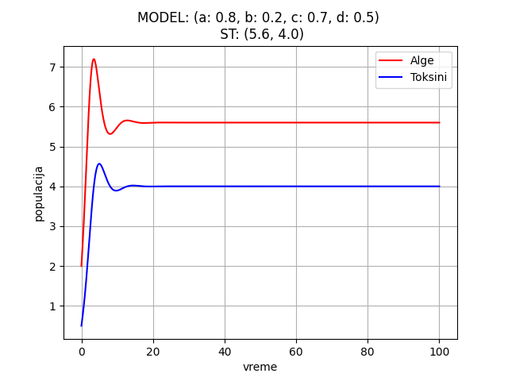
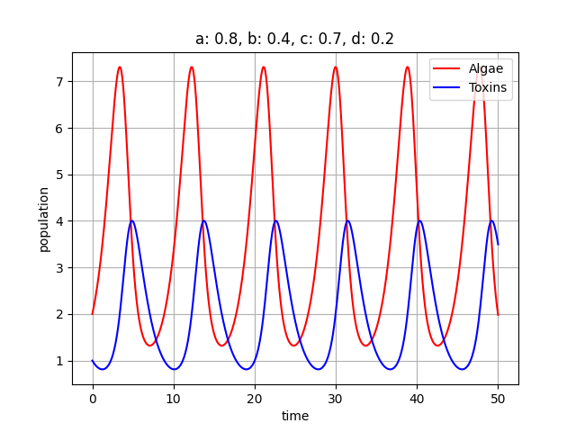
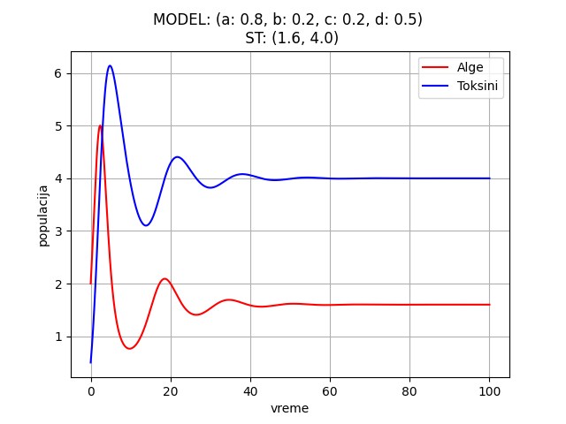
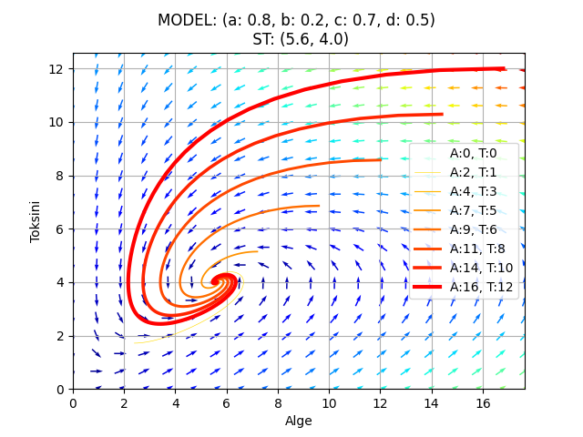

# OMM-seminarski

Lotka Voltera model:  
dX/dt = a*X - b*X*Y  
dY/dt = -c*Y + d*X*Y

a - natalitet vrste(alge, ljudi ili slicno)  
b - umanjenje vrste pod uticajem toksina  
c - mortalitet toksina  
d - stopa nastajanje toksina u zavisnosti od vrste  

Stacionarne tačke:  
x = 0, y = 0  
x = c/d, y = a/b

***
<h3> Početni model </h3> 
Za početne parametre uzete su jednake vrednosti koje aproksimiraju neku zlatnu sredinu. Ovo je osnovni model na kom možemo videti kako se kroz vreme menjaju populacije algi i toksina. Početne vrednosti za alge i toksine su redom 2 i 1 (možemo ih posmatrati u hiljadama jedinki) i to samo znači da u početnom trenutku imamo dva puta više algi nego toksina. Na modelu možemo videti (time=10) kako se prilikom povećanja populacije postepeno povećava broj toksina do tačke optimuma populacije algi (time=~12) kada zbog uticaja toksina počinje polako da opada populacija, a ubrzo nakon toga (time=~15) počinje i opadanje toksina jer se smanjuje broj algi od kojih toksini zavise. Ovo je kružni proces koji se ponavlja kroz vreme.

***
<h3> a </h3> 

Kada povećamo natalitet algi, možemo primetiti da alge za nijansu prelaze granicu 2 sa leve strane, ali je mnogo bitnije primetiti povećanje koncentrancije toksina, jer što je više algi to će se više toksina stvoriti. 

Kada smanjimo natalitet algi, možemo primetiti spor rast populacije algi što je očigledno na osnovu širokog levka koje pravi crvena linija. U skladu sa njom i plava linija sporo raste što znači da broj toksina prati populaciju algi.

***
<h3> b </h3> 

Kada povećamo uticaj toksina na smrtnost algi, vidimo da crvena linija ima učestaliju frekvenciju što znači da nakon nastanka alge brzo izumiru pod uticajem toksina. Zbog brzog izumiranja algi vidimo da se toksini ne mogu previše razviti.

Kada smanjino uticaj toksina na smrtnost algi, život algi postaje duži. Nisku stopu smrtnosti algi možemo zaključiti na osnovu širokog levka koji pravi crvena linija. U skladu sa tim se povećava broj toksina kroz vreme jer alge duže žive i proizvode toksine.

***
<h3> c </h3> 

Kada se poveća mortalitet toksina, vidimo da plava linija ne dostiže visoke vrednosti, odnosno toksini brzo izumiru. Takođe vidimo da populacija algi normalno funkcioniše i zbog brzog izumiranja toksina broj algi se jako slabo smanjuje i varira između 1.3 i 2. 

Kada smanjimo mortalitet toksina, oni duže žive i utiču na smrtnost algi. Zbog toga crvena linija, koja aproksimira alge, prilazi nuli i faktički imamo izumiranje vrste. Kod plave linije vidimo da se sporo spušta što odgovara tome da toksini imaju nizak mortalitet.

***
<h3> d </h3> 

Kada povećamo nastajanje toksina, vidimo kako plava linija prelazi granicu 3, a setimo se da je na početku bila oko 2. Sa većim brojem toksina i njihovim uticajem, smanjuje se populacija algi. Kako se populacija algi smanjuje, toksini nemaju kako da nastanu. Zato u trenutku kada alge dostignu minimum, počinje nagli pad populacije toksina.

Kada smanjimo nastajanje toksina, vidimo kako se toksini kreću oko granice 1. Takođe zbog malog broja toksina, povećava se koncentrancija algi do granice 3.

***
<h3> Razni modeli </h3>

Možemo smatrati da je natalitet algi i više nego dobar (a>0.5) i da alge prozvode neznatan broj toksina (d<0.5). Kada toksini nastanu, oni brzo izumiru (c>0.5) i uticaj toksina na smrtnost algi nije toliko jak (b<0.5). Model prikazuje da zbog dobrog nataliteta i malog uticaja toksina, alge dostižu visoku vrednost preko 7. Za toksine možemo videti da su u 1:2 odnosu naspram algi, što je u skladu sa počentim tačkama. Teško nastaju, brzo izumiru, ali zbog velikog broja algi uvek će ih biti.

U drugom modelu za natalitet i nastajanje toksina imamo istu pretpostavku. Međutim, u ovom primeru imamo mnogo jači uticaj toksina na smrtnost algi (b>0.5) kao i nisku stopu izumiranja toksina(c<0.5). Na osnovu ovoga, vidimo da toksini nadvladavaju algama.

***
<h3> Trajektorije populacija </h3>

Za različite početne vrednosti, populacije će se drugačije razvijati. Grafik sa trajektorijama pokazuje kako se razvijaju populacije u odnosu na početne vrednosti. Možemo primetiti da za male početne vrednosti populacije vrlo brzo dostižu svoje optimume i ciklus traje dosta kratko (mali prečnik). Odnosno, mali broj algi proizvodi toksine koji utiču na njihovu smrtnost tako da alge brzo dostižu svoj maksimum i izumiru. U skladu sa tim, toksini izumiru i brzo dolaze u minimalno stanje jer algi više nema.

Nasuprot tome, kod većihi početnih vrednosti, ciklus traje dosta duže (veliki prečnik). 
Na početku imamo veliku populaciju algi koja počinje da proizvodi toksine. U međuvremenu se  alge i razmnožavaju tako da će biti potreban duži vremenski period da se proizvede velika količina toksina koja će imati uticaj na alge. U trenutku kada toksini nadjačaju alge, počinje proces izumiranja toksina jer algi više nema. I ovaj proces traje duže vreme jer je populacija toksina na visokom nivou.

